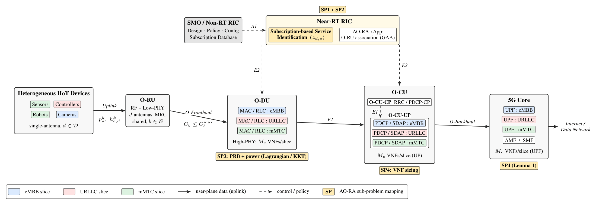

# AO-RA: Subscription-based Slicing and Resource Allocation for Massive IIoT in O-RAN

Reference implementation and simulation code for the paper:

> R. Khadhraoui, L. Ferdouse, and L. Nasraoui, "Subscription-based Slicing and
> Resource Allocation for Massive IIoT in O-RAN," .

AO-RA is a unified **Alternating Optimization-based Resource Allocation**
framework for uplink resource allocation in massive IIoT-enabled O-RAN
networks. The Near-RT RIC identifies the service class of each IIoT device
(eMBB, URLLC, or mMTC) at registration time via a subscription-based
mechanism, and the joint O-RU association, PRB assignment, transmit power
control, and VNF sizing problem (an MINLP) is decomposed into four
sub-problems, each mapped to its native O-RAN functional entity:

| Sub-problem | O-RAN node    | Variable        | Method                       |
|-------------|---------------|-----------------|------------------------------|
| SP1         | Near-RT RIC   | `z_{d,c}`       | Subscription-based (fixed)   |
| SP2         | Near-RT RIC   | `x_{b,d}`       | Greedy Assignment (GAA)      |
| SP3         | O-DU          | `a_{b,d}^k, p_d^k` | Lagrangian + KKT          |
| SP4         | O-CU-UP / UPF | `M_c`           | Closed form (Lemma 1)        |


## System architecture



## How it works

IIoT devices (sensors, robots, controllers, cameras) transmit uplink
data through a shared O-RU to per-slice VNF chains at the O-DU,
O-CU-UP, and UPF. The AO-RA framework decomposes the joint resource
allocation problem into four sub-problems, each executed at its native
O-RAN entity:

1. **SP1 — Service identification (Near-RT RIC):** each device's
   service class (eMBB / URLLC / mMTC) is retrieved once from the
   subscription database and fixed before optimization — no online
   inference.
2. **SP2 — O-RU association (Near-RT RIC):** a load-aware Greedy
   Assignment Algorithm (GAA) assigns each device to an O-RU under
   the fronthaul capacity constraint.
3. **SP3 — PRB and power allocation (O-DU):** a dual-guided
   Lagrangian/KKT procedure assigns PRBs and transmit powers while
   enforcing per-class rate and delay bounds.
4. **SP4 — VNF sizing (O-CU-UP/UPF):** the minimum number of VNF
   instances per slice is computed in closed form (Lemma 1) to meet
   each slice's end-to-end delay budget.

The three sub-problems SP3 → SP4 → SP2 alternate cyclically until the
weighted sum data rate converges (typically 2–3 iterations).


## Repository structure

```
.
├── ao_ra.py               # Core implementation: parameters (Table III),
│                          # rate/SINR models, SP1–SP4, AO-RA (Algorithm 2),
│                          # Baseline & DR benchmarks, Monte Carlo, plotting
├── generate_figures.py    # Reproduces Figs. 1–5 of the paper
├── verify_constraints.py  # Per-device constraint verification tables
│                          # (C1, C4, C5 per device; C8 per O-RU)
├── requirements.txt
├── CITATION.cff
├── LICENSE
└── results/               # Generated figures and cached Monte Carlo data
```

## Installation

Requires Python ≥ 3.9.

```bash
git clone https://github.com/rouakhadhraoui/AO-RA-IIoT-ORAN.git
cd AO-RA-IIoT-ORAN
pip install -r requirements.txt
```

## Reproducing the paper figures

```bash
# Full reproduction (100 Monte Carlo realizations per configuration).
# Results are cached in results/mc_results.npy after the first run.
python generate_figures.py

# Force a full re-run of the Monte Carlo experiment
python generate_figures.py --force

# Quick smoke test (few runs; numbers will NOT match the paper)
python generate_figures.py --quick
```

Outputs are written to `results/` as both PDF (submission quality, 300 dpi)
and PNG:

| File                        | Paper figure | Content                                        |
|-----------------------------|--------------|------------------------------------------------|
| `fig1_convergence`          | Fig. 1       | Weighted sum rate vs. outer AO iterations      |
| `fig2_utility_vs_D`         | Fig. 2       | Weighted sum rate vs. number of devices        |
| `fig3_delay_vs_lambda`      | Fig. 3       | URLLC end-to-end delay vs. arrival rate        |
| `fig4_utility_vs_power`     | Fig. 4       | Weighted sum rate vs. max transmit power       |
| `fig5_oru_load`             | Fig. 5       | O-RU load distribution (D = 27)                |

**Note:** full reproduction takes on the order of a few hours on a laptop
(the implementation is pure NumPy for readability; the dominant cost is the
Fig. 3 delay sweep). The `--quick` flag is provided for validating the
pipeline end-to-end in a few minutes.

## Constraint verification

Per-device satisfaction of the paper's constraints (C1 power cap, C4 minimum
rate, C5 end-to-end delay, C8 fronthaul capacity, plus starvation and PRB
distribution checks) can be regenerated with:

```bash
python verify_constraints.py            # D = 9 and D = 27 (default)
python verify_constraints.py -D 18 36   # custom device counts
```

Each run prints the full table and exports it to `AO_RA_debug_D<D>.xlsx`.
For the deterministic seed used in the paper (42), all configurations show
**zero constraint violations and zero starved devices**.

## Reproducibility

- All randomness is controlled by explicit, deterministic seeds:
  Monte Carlo realization *n* for device count *D* uses seed
  `n·1000 + D`, so every realization can be regenerated independently.
- Realizations that do not admit a feasible point are discarded before
  optimization (see `run_monte_carlo` in `ao_ra.py`), consistent with the
  methodology described in Section VI of the paper.
- Simulation parameters exactly match Table III of the paper and are defined
  at the top of `ao_ra.py`.

## Requirements

- `numpy`
- `scipy`
- `pandas`
- `matplotlib`
- `openpyxl` (Excel export in `verify_constraints.py`)

## Citation

If you use this code, please cite the paper (see `CITATION.cff`):

```bibtex
@article{,
  author  = {},
  title   = {},
  journal = {},
  year    = {2026}
}
```

## License


